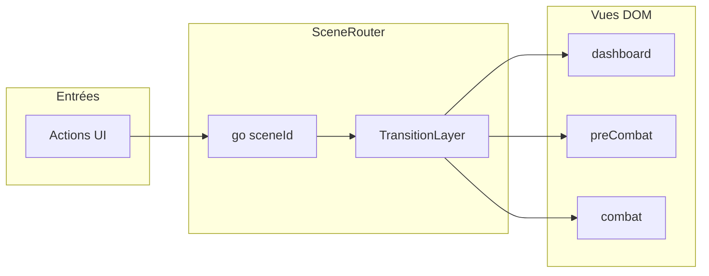

# Plan : immersion, scènes, quêtes solo et pas (Capacitor + web)

> Document de travail — à mettre à jour au fil de l’avancement (statuts des todos dans le frontmatter, sections ci-dessous).

## Contexte actuel

- Navigation par vues : [`showView`](../fitquest/src/app.js) bascule `display` / classes `active` sur `#app`, `#viewPreSession`, `#viewSession`, etc. ([`index.html`](../fitquest/index.html)).
- Pré-séance : [`renderPreSessionView`](../fitquest/src/ui/renderSession.js) affiche boss, matchup et liste d’exercices ; pas encore de **durée totale** ni **score de difficulté** explicite.
- Combat : effets limités à CSS (`flashBossPortrait`, `shakeScreen`, dégâts flottants) dans [`renderCombatFx.js`](../fitquest/src/ui/renderCombatFx.js).
- Difficulté volume : [`getDifficultyTier`](../fitquest/src/core/progression.js) (`numEx`, `sets`, `reps`, `seconds`).

**Note Vue / Options API :** le dépôt n’utilise pas Vue aujourd’hui. Si vous migrez plus tard, ce plan reste valide : un **gestionnaire de scènes** et des **services audio/sprites** se portent en composables ou en modules partagés ; en Vue 3, privilégier **Options API** comme vous le souhaitez.

---

## 0. Capacitor iOS/Android dès maintenant + développement web intact

**Principe :** une seule base **Vite** ; les shells natifs ne font que servir le bundle dans une `WebView`. Le quotidien reste `npm run dev` (navigateur). Les builds natifs consomment `vite build` puis `cap sync`.

**Bootstrap (à réaliser en premier dans la roadmap d’implémentation) :**

- Dépendances : `@capacitor/core`, `@capacitor/cli`, `@capacitor/ios`, `@capacitor/android`.
- Fichier `capacitor.config.ts` (ou `.json`) à la racine du package app (`fitquest/`) avec au minimum :
  - `appId` (ex. `com.wayzdigital.fitquest`)
  - `webDir: 'dist'` (sortie par défaut de Vite ; aligner si `vite.config` change `build.outDir`)
- Commandes natives une fois les projets ajoutés : `npx cap add ios` et `npx cap add android` (génère `ios/` et `android/`).

**Scripts npm recommandés** (dans [`fitquest/package.json`](../fitquest/package.json)) :


| Script         | Rôle                                                                               |
| -------------- | ---------------------------------------------------------------------------------- |
| `dev`          | Inchangé : `vite` — **flux principal de développement web**                        |
| `build`        | `vite build` — artefact statique dans `dist/`                                      |
| `build:native` | `vite build && npx cap sync` — met à jour les apps iOS/Android avec le dernier web |
| `open:ios`     | `npx cap open ios` — ouvre Xcode (build/sign côté machine locale)                  |
| `open:android` | `npx cap open android` — ouvre Android Studio                                      |


**Cycle « créer l’app » :** après `build:native`, ouvrir la plateforme cible et lancer depuis Xcode ou Android Studio (certificats iOS, SDK Android locaux requis — hors périmètre automatisé sans CI dédiée).

**Ne pas casser le web :**

- Aucune logique critique dans des fichiers uniquement natifs ; utiliser `import.meta.env` ou détection `Capacitor.getPlatform() === 'web'` pour les branches optionnelles (ex. pas réels vs mock).
- Plugins Capacitor (santé, etc.) appelés derrière l’interface `StepCounter` (§5) : **no-op ou mock sur web**.

**`.gitignore` :** selon politique d’équipe, versionner ou ignorer `ios/` et `android/` ; si ignorés, documenter « regénérer avec `cap add` + sync » sur une nouvelle machine.

---

## 1. Audio : ambiance + SFX par événement

**Objectif :** musique de fond (boucles par zone ou par type de scène) + banque de SFX (clic UI, validation exercice, dégât boss/joueur, potion, sort, victoire/défaite).

**Approche technique (web + natif via même bundle) :**

- Module central **`AudioBus`** (ex. `src/audio/audioBus.js`) : volumes séparés BGM / SFX, état « mute », déblocage après premier geste utilisateur (`audioContext.resume()` ou lecture `HTMLAudioElement` après interaction — requis sur mobile et WebView Capacitor).
- **BGM :** `HTMLAudioElement` en boucle ou Howler.js si vous voulez crossfade ; une piste par « ambiance » (dashboard, pré-combat, combat) référencée depuis les métadonnées de scène (voir §3).
- **SFX :** fichiers courts (`.ogg` + `.m4a` fallback pour iOS) dans `public/audio/`.
- **Couplage UI :** un petit **`gameEvents`** (emit/subscribe) appelé depuis les actions existantes (`confirmExerciseSubmission`, `castSpell`, clic boutons dans `bindUi`, etc.) pour ne pas disperser `new Audio()` partout.

**Capacitor :** les assets audio sont copiés avec `dist/` au sync ; tester le mode silencieux physique et le bouton volume sur appareils réels.

---

## 2. Sprites WebP « grille Mugen » (max 12 images / animation)

**Votre idée (12 images max) :** cohérente pour la prod et l’édition : feuilles compactes, cycles lisibles, faciles à remplacer. Recommandation : **12 fps max en idle**, un peu plus pour les hits courts (ou sous-échantillonner visuellement avec moins de frames réelles).

**Format de données (évolutif) :**

- Un fichier image unique par personnage : `public/sprites/{id}/sheet.webp`.
- Un JSON par personnage, ex. `public/sprites/{id}/atlas.json` :

```json
{
  "frameWidth": 128,
  "frameHeight": 128,
  "cols": 4,
  "animations": {
    "idle": { "row": 0, "frames": 8, "fps": 8, "loop": true },
    "enter": { "row": 1, "frames": 10, "fps": 12, "loop": false },
    "hit": { "row": 2, "frames": 6, "fps": 14, "loop": false }
  }
}
```

- Le **cadrillage virtuel** : `background-image` + `background-position` sur un `<div class="sprite">`, ou **Canvas 2D** si vous voulez des rotations / filtres. Pour rester simple et performant sur mobile, **CSS sprite** + mise à jour par `requestAnimationFrame` suffit au début.

**Machine à états boss (combat) :** `idle` → `enter` (une fois à l’ouverture de la scène combat) → `idle` / `hit` (sur dégât) → `attack` (pendant riposte boss, synchronisé avec le `setTimeout` existant ~700 ms) → retour `idle`. **Potion** : déclencher une courte anim « buff » sur le portrait joueur ou un overlay FX si pas de sprite héros au départ.

**Spells / projectiles :** feuilles séparées petites format (`spell_fire.webp` + atlas) ou même grille ; réutiliser `gameEvents` pour lancer l’anim au moment de `castSpell`.

**Placeholder par défaut :** 1 boss « générique » avec atlas minimal pour valider le pipeline avant d’illustrer tous les ennemis.

---

## 3. Système de scènes + transitions type FF7

**Objectif :** traiter chaque « page » comme une **scène** (dashboard, préparation combat, combat, inventaire, admin, futures zones…) avec **transition dédiée** à chaque changement (ex. fondu + léger zoom, wipe, ou glitch léger pour combat).

**Architecture proposée :**

- **`SceneId`** enum / constantes string (`dashboard`, `preCombat`, `combat`, `hub`, …).
- **`SceneRouter`** : remplace progressivement les appels directs à `showView` par `router.go('combat', { transition: 'battle-swirl', payload })`.
- **Couche transition :**
  - **Priorité :** [View Transitions API](https://developer.mozilla.org/en-US/docs/Web/API/View_Transition_API) pour cross-fade natif du navigateur quand `document.startViewTransition` est disponible.
  - **Fallback :** overlay plein écran (div fixed) avec animations CSS + `prefers-reduced-motion` pour désactiver ou raccourcir.
- **File d’attente :** pas de double navigation concurrente ; si transition en cours, ignorer ou mettre en file le prochain `go()` (évite clics répétés).




**Fluidité :** précharger assets critiques de la scène suivante (`link rel=preload` ou import dynamique des atlas audio de la scène) dans `router.beforeEnter`.

---

## 4. Quêtes solo

**Contenu :**

- Extension du state dans [`defaultState`](../fitquest/src/core/state.js) : `quests: { active: [], completed: [], daily?: … }`.
- Fichiers données [`gameCatalog.js`](../fitquest/src/data/gameCatalog.js) ou JSON dédié : quêtes avec objectifs (`defeat_boss`, `complete_sessions`, `walk_steps`, `zone_visit`).
- UI : panneau sur le dashboard ou entrée de menu « Quêtes » (nouvelle scène).

Modèle de données centré sur un **seul joueur** : `questId`, `progress`, pas de synchronisation multijoueur.

---

## 5. Déplacement entre zones par nombre de pas (API natives)

**Abstraction obligatoire :**

- Interface **`StepCounter`** dans `src/native/steps.js` :
  - **Web (`vite dev` / navigateur) :** mock, saisie manuelle de test, ou lecture optionnelle si API web un jour — le jeu doit rester **entièrement jouable sans capteurs**.
  - **Capacitor iOS :** HealthKit via plugin communautaire adapté (permissions et usage fitness à déclarer pour l’App Store).
  - **Capacitor Android :** Health Connect et/ou Google Fit selon la compatibilité OS ; agrégation « pas du jour » ou delta depuis minuit.

**Lien gameplay :** dans [`world.js`](../fitquest/src/core/world.js) / état joueur, stocker `stepsBudget` ou `stepsAccumulated` ; franchir une zone coûte **N pas** (configurable par zone dans le catalogue). Message utilisateur du type « Encore X pas pour la Forêt ».

**Sync avec §0 :** après chaque `vite build`, `cap sync` déploie le même JS ; seules les permissions natives diffèrent par plateforme.

---

## 6. Scène « Préparer la séance » : projection combat / exercice

Enrichir [`renderPreSessionView`](../fitquest/src/ui/renderSession.js) (données déjà disponibles : `tier`, liste `proposed`, stats boss) avec :


| Élément    | Source / calcul                                                                                                                                                  |
| ---------- | ---------------------------------------------------------------------------------------------------------------------------------------------------------------- |
| Ennemi     | Déjà affiché ; ajouter sprite animé `idle` + entrée optionnelle au montage de la scène                                                                           |
| Programme  | Liste déjà là ; ajouter **durée estimée** : ex. `numEx * sets * (reps * secPerRep)` avec secPerRep hypothèse (ex. 3–5 s/rep) + temps de repos configurable       |
| Difficulté | Score **1–10** ou **étoiles** dérivé de `tier`, `boss.level`, `rarity`, éventuellement PV max du boss (fonction pure dans `progression.js` pour rester testable) |


Texte court type « Tu affrontes un adversaire niveau X ; séance estimée ~Y min ; difficulté Z/10 » pour la projection mentale.

---

## Ordre de mise en œuvre suggéré (risque / valeur)

1. **Capacitor + scripts `build` / `build:native` / `open:*`** — fondation iOS/Android sans toucher à la logique métier ; valider `vite dev` et build web.
2. **`gameEvents` + `AudioBus`** — impact UX immédiat sur web et natif.
3. **`SceneRouter` + transitions** — UX cohérente pour la suite.
4. **Atlas sprite + composant boss animé** — une fois le routeur stabilise le DOM combat/pré-combat.
5. **Pré-séance enrichie** (durée + score) — rapide une fois `getDifficultyScore` défini.
6. **Quêtes solo** dans le state + catalogue.
7. **`StepCounter` + plugins santé** — dépend des comptes développeur et permissions ; web mock toujours actif.

---

## Fichiers clés à faire évoluer

- [`fitquest/package.json`](../fitquest/package.json) : scripts Capacitor et dépendances.
- Racine `fitquest/` : `capacitor.config.ts`, dossiers `ios/`, `android/` (générés).
- [`fitquest/src/app.js`](../fitquest/src/app.js) : centraliser navigation vers `SceneRouter`.
- [`fitquest/src/ui/renderSession.js`](../fitquest/src/ui/renderSession.js) : pré-combat enrichi + hook animations.
- [`fitquest/src/core/state.js`](../fitquest/src/core/state.js) + migration version : quêtes, compteurs de pas optionnels.
- [`fitquest/src/core/progression.js`](../fitquest/src/core/progression.js) : `getDifficultyScore` / helpers durée.
- Nouveaux dossiers suggérés : `src/audio/`, `src/scenes/`, `src/sprites/`, `src/native/`, `public/audio/`, `public/sprites/`.
